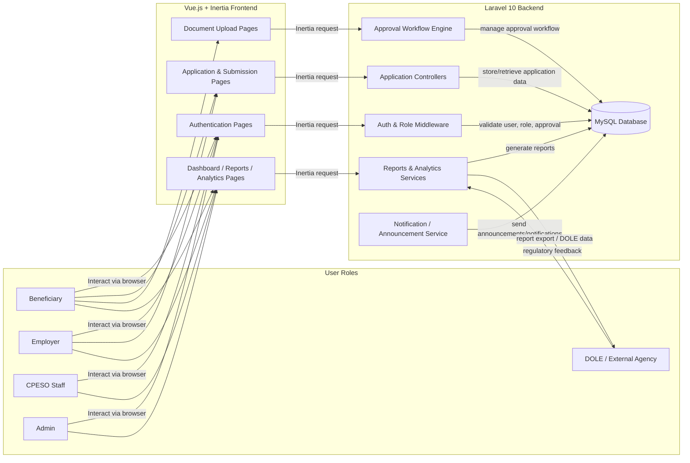
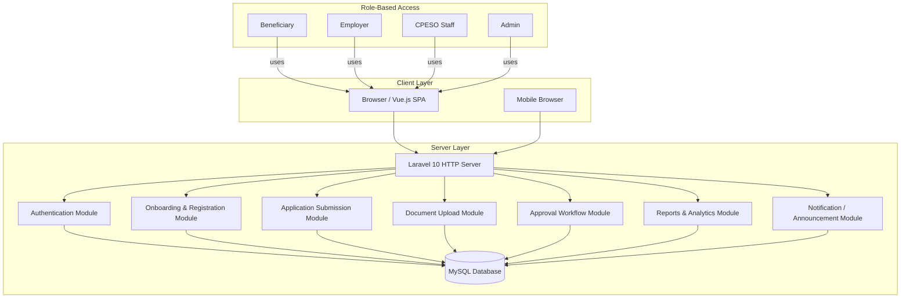
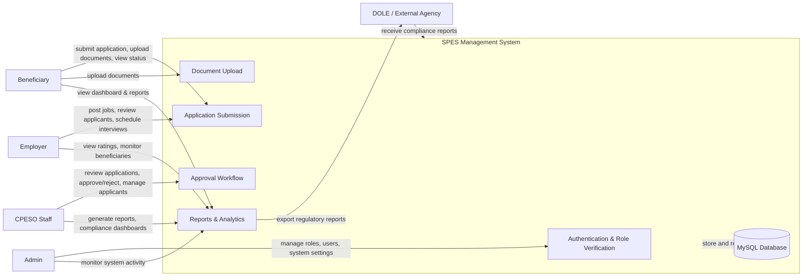
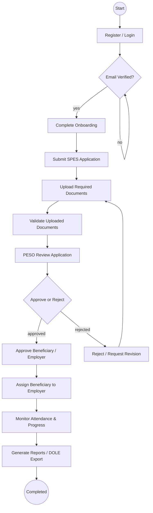
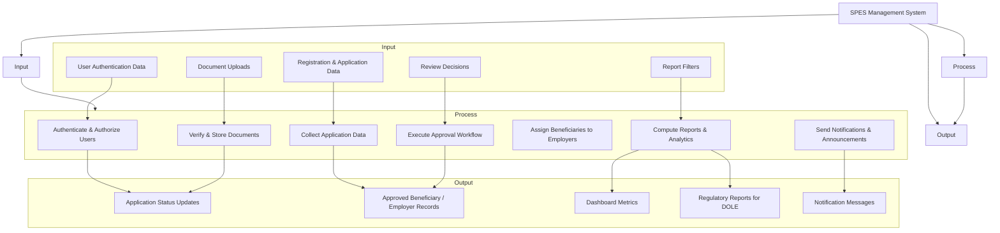

# SPES Management System Diagrams

This document contains professional system diagrams for the SPES (Special Program for Employment of Students) web-based system, based on the existing Laravel + Vue.js (Inertia) implementation.

## 1. System Flow Diagram

## 2. Block Diagram

## 3. Context Diagram

## 4. Flowchart (Application to Approval Process)

## 5. HIPO Diagram (Hierarchical Input-Process-Output)

---

### Notes
- All diagrams reflect the actual role-based Laravel route structure and Inertia/Vue frontend flow.
- The system architecture is consistent across the diagrams: Browser → Vue/Inertia frontend → Laravel backend → MySQL database.
- The approval flowchart uses the real onboarding, document upload, PESO review, and approval modules present in the codebase.
- `DOLE` is represented as the external regulatory consumer of report exports.
